# Launch Readiness Incident - Track B Report

**Decision:** No deployment  
**Next possible stage:** Five-venue controlled pilot  
**Time spent:** Add the real elapsed time before submission

## Scope and evidence

I did not have access to Gastropilot source code, production settings,
credentials or customer data. I built a small independent example from the
sanitized brief. It shows how I would make the release gate fail closed.

I use three evidence labels:

- **Brief:** information supplied in the case study.
- **Demonstrated:** something reproduced or fixed in this repository.
- **Assumption:** a condition that still needs an owner to approve it.

This report does not describe Gastropilot's current production system.

## 1. Incident map

| Finding | Type | Severity | Owner | Confidence |
|---|---|---:|---|---:|
| CI hides failures with `|| true`. | Release system | Blocker | Technical lead | High |
| Auth bypass leaks between tests. | Security and test | Blocker | Security and test owners | High |
| Code, settings and database version are not matched to the running system. | Release system and owner action | Blocker | Release, infrastructure and database owners | Medium |
| Integration tests are missing test-only settings. | Release system | High | Platform owner | High |
| The configured timeout plugin is missing. | Release system | High | Test owner | High |
| The budget test expects fake data instead of the intended error. | Test | Medium | Service owner | High |
| Signup and durable onboarding fixes are not merged. | Product | High | Product and engineering owners | Medium |
| Operational tests use an old request format. | Test | Medium | Service owners | High |
| Security actions and approvals are incomplete. | Security and owner action | Blocker | Security and company owners | High |
| Lint debt and the bundle warning are not proven launch failures. | Non-blocking debt | Low | Engineering owners | Medium |

### Three highest-risk blockers

1. **CI can lie.** The release decision depends on CI. If CI changes failure to
   success, the rest of the release evidence cannot be trusted. The example
   baseline reproduced this pattern. The test failed, but the workflow used
   `|| true`, and the hosted run still reported success. See
   [Evidence B1](#b1-failed-test-hidden-by-ci).

2. **Security tests depend on collection order.** One test can leave the local
   auth bypass enabled for another test. This can hide an access-control bug.
   See [Evidence B4](#b4-security-test-contamination).

3. **The running system is not matched to the reviewed system.** A green commit
   does not prove which code, settings or database version is running. It also
   makes rollback unsafe. This remains unproven because the brief provides no
   staging evidence.

These issues rank above the stale test, missing timeout plugin and lint backlog
because they affect the whole release or create direct security and data risk.

## 2. Release decision

My current recommendation is **no deployment**. I would not approve a public
launch or a controlled pilot from the supplied state.

The decision can change to **controlled pilot** only when every gate below has
evidence. Public launch is a later decision based on pilot results.

### Measurable gates

1. **Match the running system to one reviewed commit.** The build record,
   deployment record and runtime version must name the same commit. Any mismatch
   blocks release.

2. **Prove the database and settings.** Migrations must work in staging. The
   schema must match the release. An owner must approve the settings without
   exposing secrets. Drift or an unknown setting blocks release.

3. **Run honest CI.** Every required command must return its real exit code. A
   clean hosted run must pass. A masked failure, skipped job or missing log
   blocks release.

4. **Prove security-test isolation.** Security tests must pass alone, in the
   full suite and in the opposite order. The auth bypass must be off by default.
   Any leak or unexpected authorization blocks release.

5. **Keep the correct failure contract.** Budget exhaustion must raise
   `ServiceUnavailable`, record `automation_budget_stop` and return no fake
   data. Silent fallback or a missing audit event blocks release.

6. **Activate timeouts and control known failures.** The timeout plugin must be
   pinned and active. Each known failure needs a strict ID. A new failure or an
   unexpected pass blocks release.

7. **Run the staging journeys.** Login, venue isolation, signup, onboarding,
   jobs and included integrations must save and reconcile staging data. Data
   loss, cross-venue access or false success blocks release.

8. **Collect owner approvals.** Security actions, storage, legal text, hosting
   and rollback need named, dated approvals. A missing owner or approval blocks
   release.

### Smallest acceptable pilot

The smallest release is **five named venues**. It is invite-only, with named
staff accounts, manual onboarding, agreed support hours and one release owner.
There is no public signup, automatic expansion or public launch date.

Email, payment and provider features are included only after their own staging
checks pass. Otherwise they remain disabled. The product owner must confirm
that the smaller journey still gives the venues useful value.

The pilot stops immediately for suspected cross-venue access, auth bypass,
data loss, migration mismatch, request-integrity failure or an unknown deployed
version. Expansion requires five operating days with no security or data-loss
trigger, complete daily reconciliation and no new blocking failure.

## 3. The next 48 hours

**Hours 0–2 - Take control.** I keep the decision at no deployment, freeze the
release candidate and name release, security and database owners. The output is
an incident map, owner list and exact baseline commit. Work stops if a critical
decision has no owner.

**Hours 2–8 - Reproduce the failures.** The technical lead integrates
stabilization first. The test owner reproduces false-green CI, missing settings,
the timeout warning and auth contamination. We save commands, exit codes and
screenshots. If we cannot reproduce a failure, we return to diagnosis.

**Hours 8–16 - Repair the release gate.** Platform and security owners review
the changes. CI must fail when a failure is injected and pass after correction.
Security tests must pass in both orders. A masked failure or auth leak keeps the
release closed.

**Hours 16–24 - Integrate onboarding.** Product and engineering owners rebase
onboarding onto the stable candidate. They prove that successful signup and
workflow responses create saved data. Unknown settings or false success stop
the merge.

**Hours 24–36 - Prove staging.** Release and database owners deploy the exact
candidate commit, apply migrations and test rollback. They record the running
commit, schema version and migration result. Any mismatch rolls back the
candidate, but the fail-closed CI rules remain.

**Hours 36–44 - Run pilot journeys.** Product, operations and integration
owners test the included journeys. Security completes credential and session
actions. Data loss, access failure or false success stops the review.

**Hours 44–48 - Make the decision.** I mark every gate pass, fail or unproven.
The output is a signed checklist, rollback owner, support plan and written
recommendation. Missing evidence counts as a failed gate.

### Integration order

Stabilization goes first because every later result depends on honest CI and
isolated tests. Onboarding is then rebased onto that stable candidate. The exact
combined commit goes to staging. Code, database and settings are matched before
external journeys begin.

### Work reviewed twice

- CI and test isolation: platform owner, then security owner.
- Migrations and settings: database owner, then release owner.
- Onboarding and durable writes: implementing engineer, then product owner.
- Final gate: incident lead checks the evidence; each owner approves only their
  own area.

I do not remove a safety check to meet the deadline. If a product change must be
rolled back, the fail-closed CI rules stay in place.

## 4. A release gate that cannot lie

### Required path

```text
Exact reviewed commit
        |
Clean install from pinned dependencies
        |
Static checks -> unit and integration tests -> security isolation tests
        |
Build and deploy the same commit to staging
        |
Match schema, settings and runtime version
        |
Run acceptance journeys and provider reconciliation
        |
Check monitoring, rollback and owner approvals
        |
Decide whether to start the five-venue pilot
```

Any failed or unproven step stops the path. A known failure stays visible with a
strict ID. A new failure always blocks.

### Practical patch

The repository contains two useful commits:

- `e98ad28` - illustrative failing baseline.
- `7516b24` - focused remediation.

The remediation:

- removes `|| true` from blocking CI commands;
- supplies clear test-only settings;
- pins and requires `pytest-timeout==2.4.0`;
- enables strict pytest settings and strict known-failure handling;
- updates the stale budget test to check the typed error and audit event;
- moves auth-bypass setup into one test-scoped fixture; and
- names the known legacy failure `LEGACY-001` without allowing new failures.

The before-and-after screenshots are in
[Appendix B](#appendix-b-before-and-after-evidence). The exact file changes are
in [Appendix A](#appendix-a-precise-pseudodiff).

### Pass and fail rules

- Install only declared, pinned dependencies.
- Treat any non-zero static-check result as failure.
- Allow only named strict failures; block new failures and unexpected passes.
- Run security tests alone, in the full suite and in reverse order.
- Require the staging commit, schema and settings to match the reviewed release.
- Require included journeys to save and reconcile data.
- Require active alerts, a rollback owner and a tested rollback.

### Verified commands

```bash
TEST_APP_SECRET=test-only-non-secret \
TEST_DATABASE_URL='sqlite:///:memory:' \
LOCAL_AUTH_BYPASS=0 \
python -m pytest -q --strict-config
```

Result: `4 passed, 1 xfailed`.

```bash
LOCAL_AUTH_BYPASS=0 python -m pytest -q \
  tests/test_security.py tests/test_local_auth.py
```

Result: `2 passed` in reverse order.

The hosted GitHub Actions run also passed from a clean install. See
[Evidence A5](#a5-hosted-ci-passes).

## 5. My first five days

**Day 1 - Establish the facts.** Confirm no deployment, name owners and
reproduce every blocker. Publish the baseline evidence, risk list and daily
update time.

**Day 2 - Stabilize.** Review every changed failure path and run the gate from a
clean environment. Publish the reviewed diff and honest CI result.

**Day 3 - Prove onboarding and staging.** Check that successful signup and
workflows save data. Deploy the exact candidate to staging. Publish the runtime
commit and schema report.

**Day 4 - Test the real journeys.** Run security, venue-isolation and included
integration journeys. Check logs, alerts, reconciliation and rollback. Publish
the acceptance report and remaining approvals.

**Day 5 - Decide and communicate.** Decide whether every five-venue pilot gate
passed. Brief the founder, support team, partner and venues. Publish the signed
go/no-go decision, pilot scope, support plan and next decision date.

### Difficult message

> We cannot promise a public launch date or give 100 venues access today. The
> previous green signal was not reliable, and we have not proved that the
> reviewed code, database and settings match the running system. Within 48 hours
> I will give you a gate-by-gate report. If every gate passes, I will recommend a
> five-venue pilot with named support and clear stop rules. If a gate is still
> missing, I will show the missing proof and its owner instead of presenting an
> unsafe date as progress.

### Decision I refuse to make

I would refuse to approve a pilot date until the deployed code revision,
production settings, database migration state and rollback path have been
proved together in staging.

## Release note

### Change

The focused patch makes the example release gate fail closed. Blocking CI
commands now return their real exit codes. CI uses explicit test-only settings.
The timeout plugin is pinned and required. Security-test setup is local to one
test. The budget test now checks the intended error and audit event. The one
known legacy failure remains visible under `LEGACY-001`.

### Verification

- Local full suite: `4 passed, 1 xfailed`.
- Security tests in reverse order: `2 passed`.
- Timeout provider: `pytest-timeout 2.4.0` registered.
- Hosted CI: install, static checks, unit tests and integration tests passed.

### Release effect

This patch makes the example gate honest. It does not approve deployment. The
real release still needs proof for the deployed revision, schema, settings,
security actions, staging journeys, monitoring and rollback.

### Rollback

Do not roll back by restoring `|| true`, removing security checks or removing
the timeout requirement. If a product change fails, stop the release and revert
that product change while keeping the gate fail closed. If the workflow itself
needs correction, use a reviewed follow-up commit and keep deployment blocked
until hosted CI is green again.

## AI use and timebox

I used OpenAI Codex to help organize evidence - that's it, nothing more. I chose the release decision and risk order, reviewed the
technical approach, ran the commands, captured the screenshots, controlled
the commits and drafted the report.

No real credentials, personal data or company source code were requested or
used.

**Elapsed time:** Add the real value before submission.

I stopped at one report, one focused patch and its supporting evidence. I did
not build a full hospitality product or claim that this example proves
production readiness.

---

## Appendix A - Precise pseudodiff

The exact review range is:

```bash
git diff e98ad28..7516b24
```

The focused change is:

```diff
.github/workflows/ci.yml
- run: python -m compileall -q src tests || true
+ run: python -m compileall -q src tests

- run: python -m pytest -q || true
+ env:
+   TEST_APP_SECRET: test-only-non-secret
+   TEST_DATABASE_URL: "sqlite:///:memory:"
+   LOCAL_AUTH_BYPASS: "0"
+ run: python -m pytest -q --strict-config

requirements-dev.txt
  pytest==9.1.1
+ pytest-timeout==2.4.0

pytest.ini
+ addopts = -ra --strict-config
+ required_plugins = pytest-timeout==2.4.0
  timeout = 5
+ xfail_strict = true

tests/test_service.py
- expect a mock result when the automation budget is exhausted
+ expect ServiceUnavailable("automation_budget_stop")
+ check error code, retry status and audit event

tests/test_local_auth.py
- set LOCAL_AUTH_BYPASS=1 while pytest imports the module
+ set LOCAL_AUTH_BYPASS=1 with monkeypatch inside one test

tests/test_security.py
+ remove LOCAL_AUTH_BYPASS for the anonymous-denial test

tests/test_legacy.py
+ mark the known AssertionError as strict LEGACY-001
```

## Appendix B - Before-and-after evidence

### B1. Failed test hidden by CI

The baseline core test fails. The baseline workflow runs the full suite with
`|| true`, so the hosted job can still report success.

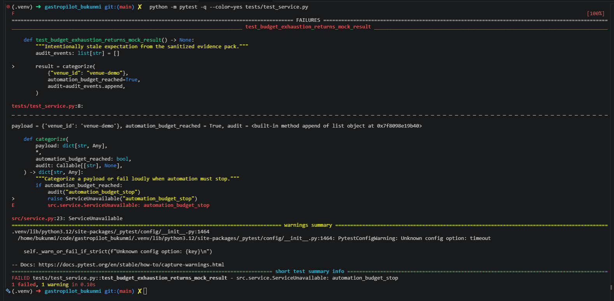

### B2. Missing test settings

The integration test cannot start because the test-only values are missing.

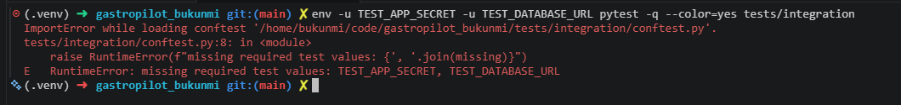

### B3. Inactive timeout

The test passes, but pytest says that `timeout` is an unknown setting. The
advertised safety limit is not active.

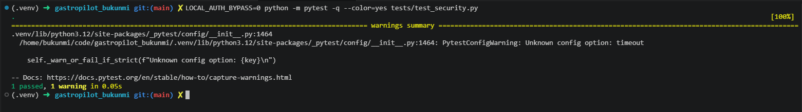

### B4. Security-test contamination

The local-auth test passes, then the anonymous-denial test fails because the
bypass remains enabled in the same test process.

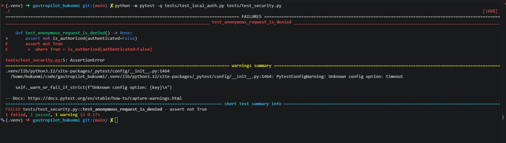

### B5. Stale budget contract

The service correctly stops with `automation_budget_stop`, but the old test
expects a mock result.

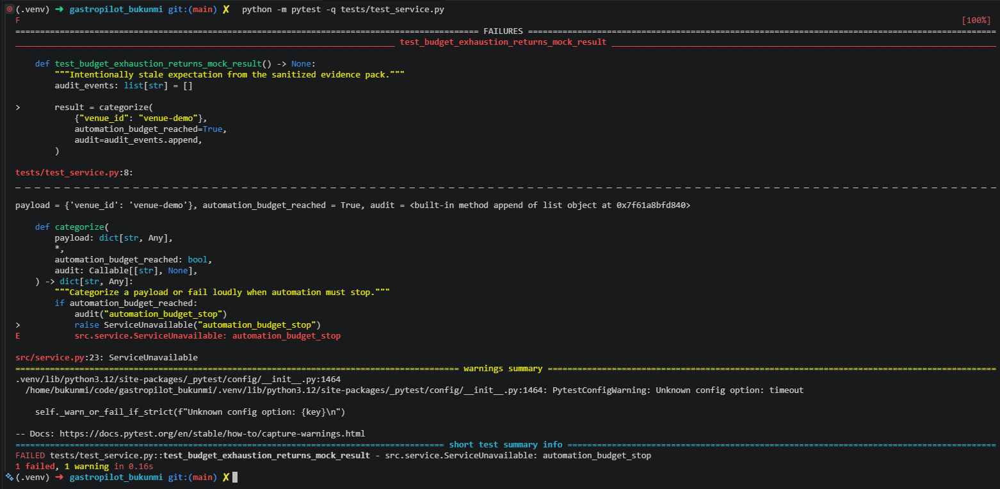

### B6. Unmanaged legacy failure

The legacy request test fails with no named policy to separate it from a new
regression.

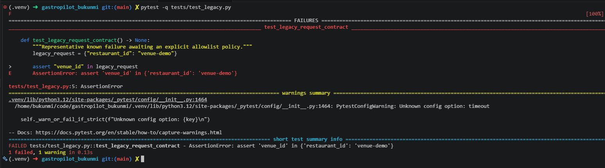

### A1. Full suite passes with one named known failure

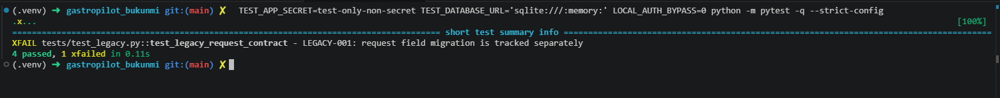

### A2. Security tests pass in reverse order

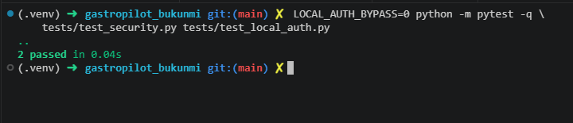

### A3. Timeout plugin is active

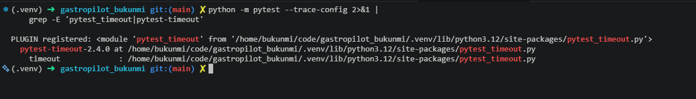

### A4. Known failure stays visible

`LEGACY-001` appears as an expected failure. Pytest still returns success for
the declared baseline, while any new failure blocks.

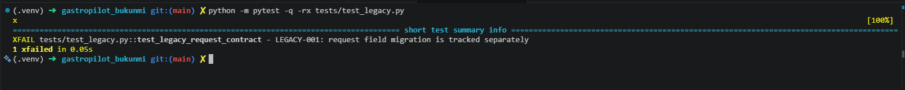

### A5. Hosted CI passes

The hosted job installs dependencies, runs static checks and runs the full test
suite. Every step is green, and the log shows `4 passed, 1 xfailed`.

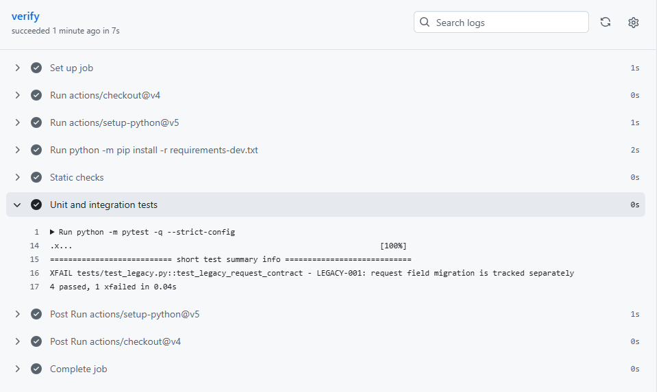

## Appendix C - Remaining risks

This example does not prove:

- which revision is running in a Gastropilot environment;
- the production database or migration state;
- credential rotation or session invalidation;
- real email, payment or provider reconciliation;
- secure-cookie, storage, default-deny or legal-text approval;
- production monitoring, support staffing or rollback; or
- readiness for public launch.
